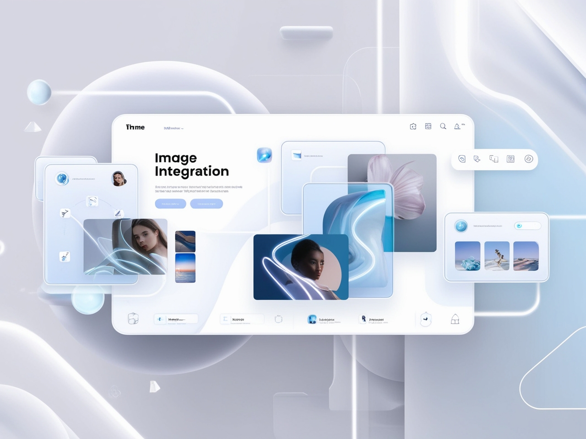

# EdiQuick - Streamlined Video Editing for Everyone



EdiQuick is a powerful Django-based web application that provides comprehensive video editing capabilities with AI-powered features. Built to streamline the video editing process, it offers an intuitive interface for both beginners and professionals.

## 🚀 Features

- **Video Effects**: Apply blur, enhancement, and various visual effects
- **Background Music Generation**: AI-powered background music creation
- **Image Integration**: Seamlessly integrate images into videos
- **Voice Processing**: Advanced voice enhancement and processing
- **Intro Maker**: Create professional video intros
- **Silence Removal**: Automatically detect and remove silent portions
- **Audio-to-Text**: Convert speech to text with high accuracy
- **Video Trimming**: Precise video cutting and trimming tools
- **Concatenation**: Merge multiple videos seamlessly

## 🛠️ Technology Stack

- **Backend**: Django 4.2+
- **AI/ML**: YOLOv11, PyTorch, OpenCV
- **Audio Processing**: Librosa, Pydub, MoviePy
- **Video Processing**: OpenCV, FFmpeg
- **NLP**: NLTK, TextBlob
- **Database**: SQLite (development)
- **Frontend**: HTML5, CSS3, JavaScript

## 📋 Prerequisites

- Python 3.8 or higher
- FFmpeg installed on your system
- At least 4GB RAM recommended
- GPU support recommended for AI features

## 🚀 Quick Start

1. **Clone the repository**
   ```bash
   git clone https://github.com/yourusername/EdiQuick.git
   cd EdiQuick
   ```

2. **Create virtual environment**
   ```bash
   python -m venv venv
   source venv/bin/activate  # On Windows: venv\Scripts\activate
   ```

3. **Install dependencies**
   ```bash
   pip install -r requirements.txt
   ```

4. **Run migrations**
   ```bash
   python manage.py migrate
   ```

5. **Start the development server**
   ```bash
   python manage.py runserver
   ```

6. **Access the application**
   Open your browser and go to `http://localhost:8000`

## 📖 Documentation

- [Installation Guide](docs/installation.md) - Detailed setup instructions
- [Features Overview](docs/features.md) - Complete feature documentation
- [Usage Guide](docs/usage.md) - How to use each feature

## 🎯 Use Cases

- **Content Creators**: Enhance videos with professional effects
- **Educators**: Create engaging educational content
- **Businesses**: Produce marketing and promotional videos
- **Social Media**: Quick video editing for social platforms
- **Personal Projects**: Edit home videos and memories

## 🔧 Core Components

### Video Processing (`member/python/`)
- `Effects_Function.py` - Video effects and filters
- `blur_func.py` - Blur effect implementation
- `concat.py` - Video concatenation
- `trim.py` - Video trimming functionality

### Audio Processing
- `audio_to_text.py` - Speech-to-text conversion
- `bg_music.py` - Background music generation
- `separator.py` - Audio separation and processing
- `Voice.py` - Voice enhancement

### AI Features
- `image_get.py` - Image processing and integration
- `nlp.py` - Natural language processing
- `sentiment.py` - Sentiment analysis

## 🤝 Contributing

1. Fork the repository
2. Create a feature branch (`git checkout -b feature/AmazingFeature`)
3. Commit your changes (`git commit -m 'Add some AmazingFeature'`)
4. Push to the branch (`git push origin feature/AmazingFeature`)
5. Open a Pull Request

## 📄 License

This project is licensed under the MIT License - see the [LICENSE](LICENSE) file for details.

## 🆘 Support

- Create an issue on GitHub for bug reports
- Check the [documentation](docs/) for common questions
- Contact the development team for enterprise support

## 🙏 Acknowledgments

- Django community for the excellent framework
- OpenCV team for computer vision capabilities
- FFmpeg for multimedia processing
- All contributors and testers

## 📊 Project Status

- **Version**: 1.0.0
- **Status**: Active Development
- **Last Updated**: January 2025

---

Made with ❤️ by the EdiQuick Team